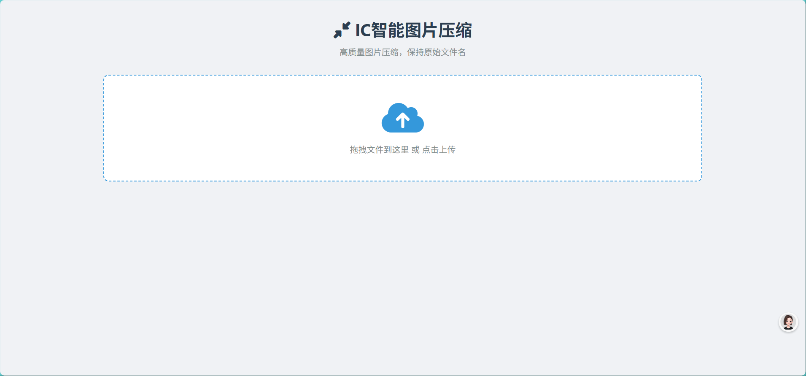

# Image Compressor (ic.aikex.ink)

 
*轻量级在线图片压缩工具*

## 功能特性
- 支持 WebP/PNG/JPEG 格式图片压缩
- 智能有损压缩技术，体积减少50%-80%
- 纯前端实现，无需上传服务器
- 响应式设计，适配移动设备

## 技术栈
- 前端：HTML5/CSS3/JavaScript
- 压缩算法：Canvas API + 自定义优化算法
- 部署：GitHub Pages

## 快速使用
1. 访问 [https://ic.aikex.ink](https://ic.aikex.ink)
2. 拖拽图片到指定区域或点击上传
3. 自动压缩后下载结果

## 开发指南
```bash
# 克隆项目
git clone https://github.com/aiyangdie/ictupian.git

# 本地运行
直接打开 index.html 即可
